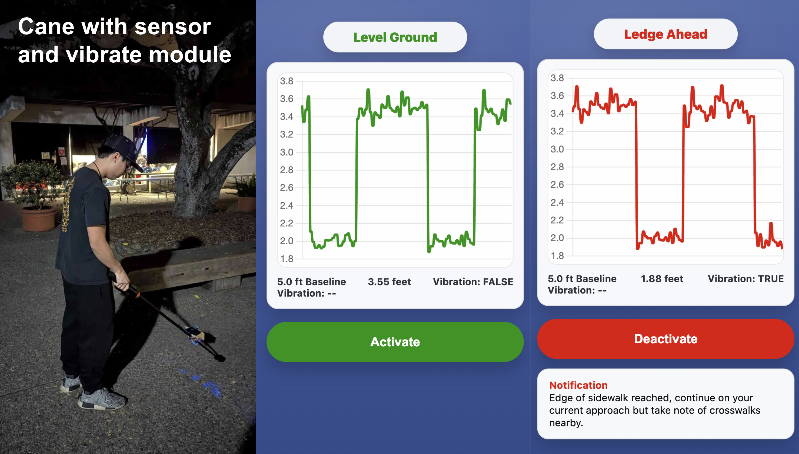

# Can(e) you see?



A cane equipped with a distance sensor and a vibration module. The cane vibrates when it detects significant changes in ground-level elevation.

## Tech stack

### Hardware/firmware

Uses [IF Magic framework](https://docs.ifmagic.io/) which integrate ESP32 microcontrollers, sensors, and firmware. We specifically used 1 vibration module, 1 distance sensor, and a mesh network with 2 ESP32 microcontroller modules.

For the microcontroller attached to the cane, we used IF Magic's 'Equations' firmware. The device then connects to a mesh network and communicates with another ESP32 module talking to a MacOS via a serial port. 

### Software

We leverage IF Magic's Python API to stream the distance data directly to a Python program. Some calibration / debouncing is applied to this data, which is then packaged into a JSON file and saved to the local filesystem. 

Another Python script running a Flask app then reads this JSON file and serves any requests on a localhost /data endpoint. 

Finally, a simple HTML frontend fetches data from the /data endpoint and displays the real-time distance data in a web browser.

## Getting started

### 1. Environment and installation

*Note: project was only tested on MacOS running Sequoia 15.7.3 and Python 3.12.12*

First, clone this repo:

```
git clone https://github.com/j-silv/caneyousee.git
```

Next, setup a Python virtual environment and install the dependencies.

```
cd caneyousee
python3 -m venv venv
source venv/bin/activate
pip install -r requirements.txt
```

To communicate with the IF Magic hardware, you will also need to setup the SLAB USB driver. Instructions are [provided here](https://docs.ifmagic.io/api/streaming#wired).

### 2. Hardware setup

Our system uses a mesh network of two [Bare^2 ESP32 modules](https://docs.ifmagic.io/the-device/bare). As of writing, there are currently no public docs on how to correctly set up this mesh network. Please reach out to IF Magic for more information. 

Assuming the mesh network is correctly configured and the driver installed, you can plug in one of devices into your computer and verify that the device is detected. You should see `/dev/cu.SLAB_USBtoUART` in the output

```
ls /dev/cu.*
```

The other Bare^2 module should be attached with a vibration sensor and a distance sensor at port 0 and port 3 respectively (the exact port numbers may be different, so refer to the source code in `sensor.py` and change if needed).

Another step not described here is the programming of the cane module using IF Magic's 'Equations'. This is described in their documentation, but essentially the remote cane module needs to be programmed with the following equation:

```
WHEN milimeters of distance IS LESS THAN 1000 turn relay to on once & WHEN milimeters of distance IS GREATER THAN 1000 turn relay to off once
```

### 3. Software 

The main script which gathers data from the IF Magic modules is `sensor.py`. The following command starts the data streaming process. For details on command-line arguments, pass in the `-h` option.

```
python sensor.py
```

After this runs, you should see distance data streaming through. If the mesh network was correctly configured, you should also be able to see real-time updates to the values when moving your hand around the distance sensor.

```
Position: 3.2 feet (baseline: 3)
Position: 3.1 feet (baseline: 3)
Position: 3.5 feet (baseline: 3)
Position: 3.4 feet (baseline: 3)
...
```

Next, you need to setup the Flask app which serves JSON data to an endpoint the frontend code can query. In another terminal, start up the Flask server:

```
python server.py
```

Finally, start up the frontend server and open up a web browser to `localhost:3000`.

```
python -m http.server 3000
```

You should be able to see streaming data in the window.

## Acknowledgements

Huge shout-out to the IF Magic team, especially to Lance and Paul. Without their help this project would of not been possible.

Thank you also to the CruzHacks 2026 team for organizing such a fun event.  